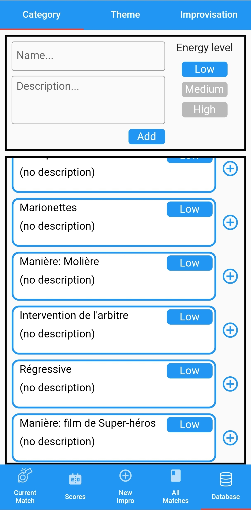
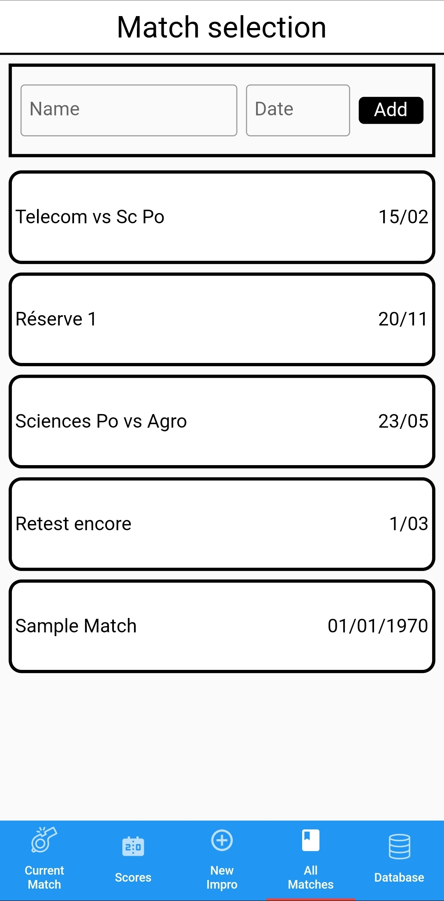
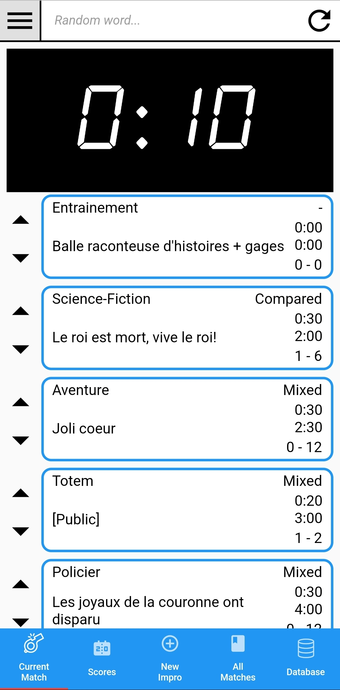
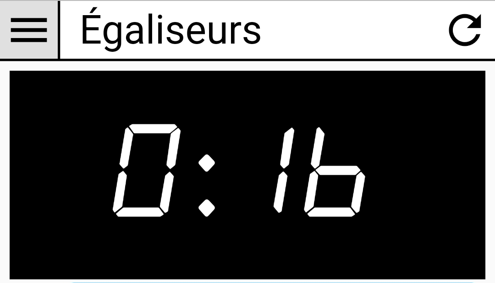

# ImproHelper

ImproHelper is an app made to help Improvisation judges to prepare and organise their improvisations list for the matches they will judge.

It provides multiple features such as:
- a generator of improvisation topics
<html>
  
</html>

- a history of all the past created improvisations
<html>
  
</html>

- a view showing all of the past and future matches registered in the app
<html>
  
</html>

- a display of the different teams' scores and a view dedicated to the current match with a built-in chronometer and the list of all the prepared improvisation topics for the match 
<html>
  
</html>

The "Current match" view also provides a random word generator for specific kinds of improvisation categories.
<html>
  
</html>

___

### Soon to come features include:
- UI rework
- Possibility to export, and import the databases to/from multiple file types
- Multiple locales support
